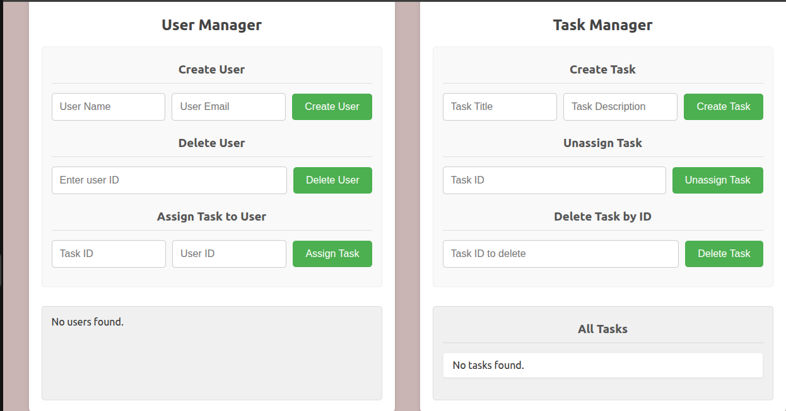
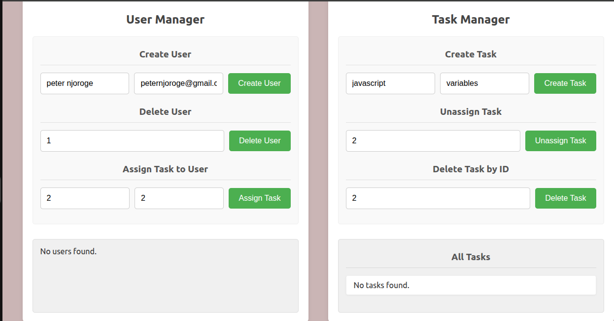

## TASK MANAGEMENT SYSTEM

This is an overview of a task and user management system which allows creation, retrieval,and deletion on user and tasks assigned.

## Description

This system is used in creation of a used in creation of a new user , assignning the user a task, deletion of user through id .Also the user can be assigned with a task, where the manager can unassign the task too.

## Screenshots

## Tech Stack
1) HTML

2)CSS

3)TYPESCRIPT

## Authors

- [Peter Njoroge Njuguna](https://github.com/Njuguna-Peter-njoroge/taskmanager-system-)

